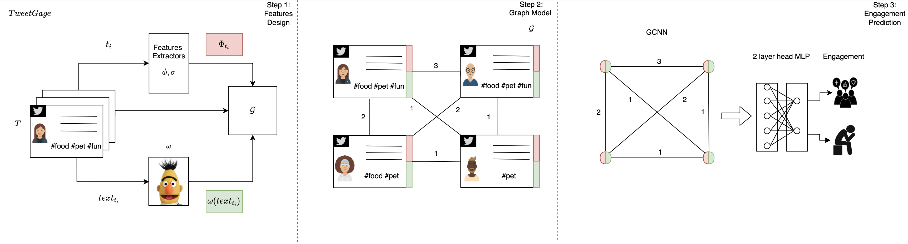
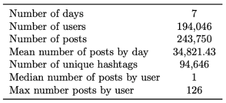
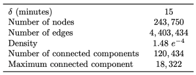
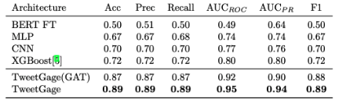
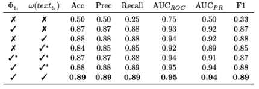

# A Graph Neural Network Framework For Post Engagement Prediction in Online social Media
Welcome to the "A Graph Neural Network Framework For Post Engagement Prediction in Online Social Media" repository!

This repository contains two works focused on predicting post engagement in online social media using graph neural networks.
The goal of this framework is to provide an effective solution for understanding and predicting the engagement of posts in online social media platforms, using the relationships between posts, users, and other network structures. The works presented here showcase the potential of graph neural networks in this field and provide a solid foundation for future research. We hope this repository serves as a valuable resource for the machine learning community.

## Predicting Tweet Engagement with Graph Neural Networks  [](http://arxiv.org/abs/2305.10103) [](https://dl.acm.org/doi/10.1145/3591106.3592294)
Official implementation of the paper: "Predicting Tweet Engagement with Graph Neural Networks"

Published in the **ACM International Conference on Multimedia Retrieval 2023 (ICMR2023)**

In this paper we present **TweetGage**, a Graph Neural Network solution to predict the user engagement based on a novel graph-based model that represents the relationships among posts. 


[Marco Arazzi](https://scholar.google.com/citations?user=8dD5SUkAAAAJ&hl=it&oi=ao),
[Marco Cotogni](https://scholar.google.com/citations?user=8PUz5lAAAAAJ&hl=it),
[Antonino Nocera](https://scholar.google.com/citations?user=YF10PJwAAAAJ&hl=it) and
[Luca Virgili](https://scholar.google.com/citations?hl=it&user=2D771YsAAAAJ) 

<p align="center">


### Requirements 
In order to replicate our results you can create an environment via Anaconda and install the required packages using pip
```
conda create -n TweetGage python=3.9
conda activate TweetGage
pip install -r req.txt
```
### Dataset
For our experiments, we considered one week of data from twitter, from [November 1st to November 7th 2021](https://archive.org/details/archiveteam-twitter-stream-2021-11),  obtained through the Twitter API.
<p float="center">
    
    
</p>

### Graph Creation

Once the tweets have been downloaded, the graph network can be build and saved as a .pickle file with:
```
python3 CreateNetwork.py
```

The script will create the graph network as 'network_tweets.pickle'.

### Running the Code

Once the graph network has been created, it is possible to replicate the results of our paper, executing the following command in your terminal:
```
python3 main.py --LOAD_CSV --EXTRACT_BERT --USE_PCA --USER_FEAT --BERT_FEAT --Model_Type 'GCN'
```
#### Arguments Explanation

The following arguments can be passed to the main.py script:

- LOAD_CSV: If you have already computed the features in a csv file, you can load it with this argument. In our code, we load the file "first_week_posts_bert.csv", which contains post features and BERT-extracted text embeddings.
- EXTRACT_BERT: Computes the text embedding of the posts using BERT (valid only if LOAD_CSV is not provided).
- USE_PCA: If True, computes the Principal Component Analysis with 48 projected features that cover more than 80% of the variance of the text features.
- USER_FEAT: If True, includes Post Features in the final feature set.
- BERT_FEAT: If True, includes Text Features in the final feature set.
- Model_Type: Can be one of the following: 'GCN', 'MLP', 'Conv1D', 'GAT', 'XGBOOST'. Default value is 'GCN'.

Note: If any argument is omitted, its default value is False.

### Results

<p float="center">
    
    
</p>

#### References
If this repo is useful to your research or you want to cite our paper please use:
```
@inproceedings{
10.1145/3591106.3592294, 
author = {Arazzi, Marco and Cotogni, Marco and Nocera, Antonino and Virgili, Luca}, 
title = {Predicting Tweet Engagement with Graph Neural Networks}, 
year = {2023}, 
booktitle = {Proceedings of the 2023 ACM International Conference on Multimedia Retrieval}, 
pages = {172–180}, 
numpages = {9}, 
location = {Thessaloniki, Greece}, 
series = {ICMR '23} 
}
```

## Available Soon...
